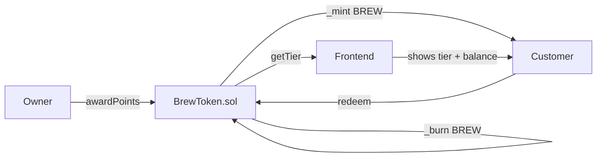

# BrewToken — ERC20 loyalty points for a coffee shop, with tiers and redemption

> Customers earn BREW tokens after each purchase. Redeem them for free drinks.
> Tiers (Bronze / Silver / Gold) unlock automatically based on balance.


🔗 **Live demo:** _coming soon_
📜 **Contract (Sepolia):** _deploy pending_

---

## What it does

- The **shop owner** awards BREW tokens to customers after purchases (`awardPoints`).
- **Customers** burn 10 BREW per reward to redeem free items (`redeem`).
- Everyone has a **loyalty tier** that updates automatically with their balance:
  - 🥉 Bronze — 0 to 99 BREW
  - 🥈 Silver — 100 to 499 BREW
  - 🥇 Gold   — 500+ BREW

## How it works



## What makes this different from a basic ERC20

| Basic ERC20 | BrewToken |
|---|---|
| Mints everything in constructor | Mints gradually per purchase |
| No access control on mint | `onlyOwner` protects `awardPoints` |
| No burn logic | `_burn` on every redemption |
| No business logic | Tier system + redemption cost |

## Tech stack

| Layer | Tech |
|-------|------|
| Smart contract | Solidity 0.8.24 + OpenZeppelin ERC20 + Ownable |
| Dev / testing | Foundry (forge, anvil) |
| Frontend | Next.js + wagmi + viem + RainbowKit |
| Network | Ethereum Sepolia testnet |

## Testing ⭐

```bash
forge test -vvv
```

15 tests covering:
- ✅ `awardPoints` mints correct balance and emits event
- ✅ Reverts: not owner, zero amount, zero address
- ✅ `redeem` burns exactly `rewardsCount × 10 BREW`
- ✅ Reverts: insufficient balance, zero rewards
- ✅ Tier logic: Bronze / Silver / Gold thresholds
- ✅ Tier drops correctly after redemption
- ✅ Standard ERC20 transfer between customers

## Run locally

```bash
forge install
forge build
forge test -vvv

# deploy to Sepolia
cp .env.example .env
# fill in SEPOLIA_RPC_URL and PRIVATE_KEY
source .env && forge script script/Deploy.s.sol \
  --rpc-url $SEPOLIA_RPC_URL --private-key $PRIVATE_KEY --broadcast
```

## What I learned

Extending OpenZeppelin's `ERC20` showed me how inheritance works in Solidity —
I get `transfer`, `balanceOf`, `approve` for free and only write the custom logic.
The `_mint` and `_burn` internal functions are the building blocks that all ERC20
logic sits on top of.

---

## Contact

**Armando Ochoa** · Smart Contract Developer
📧 armaochoa99@gmail.com · Open to Web3 opportunities.

> Built as part of my blockchain developer journey.
